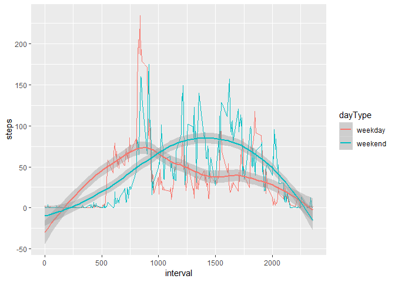

Coursera Reproducible Research
==============================

### Peer-graded Assignment: Course Project 1

#### Gerard van Meurs

#### October 25, 2018

Introduction
------------

It is now possible to collect a large amount of data about personal
movement using activity monitoring devices such as a Fitbit, Nike
Fuelband, or Jawbone Up. These type of devices are part of the
"quantified self" movement - a group of enthusiasts who take
measurements about themselves regularly to improve their health, to find
patterns in their behavior, or because they are tech geeks. But these
data remain under-utilized both because the raw data are hard to obtain
and there is a lack of statistical methods and software for processing
and interpreting the data.

This assignment makes use of data from a personal activity monitoring
device. This device collects data at 5 minute intervals through out the
day. The data consists of two months of data from an anonymous
individual collected during the months of October and November, 2012 and
include the number of steps taken in 5 minute intervals each day.

The data for this assignment are downloaded from the course web site.
The dataset is stored in a comma-separated-value (CSV) file and there
are a total of 17,568 observations in this dataset.

The variables included in this dataset are:

-   steps: Number of steps taking in a 5-minute interval (missing values
    are coded as NA
-   date: The date on which the measurement was taken in YYYY-MM-DD
    format
-   interval: Identifier for the 5-minute interval in which measurement
    was taken

### 1. Code for reading in the dataset and/or processing the data

    # loading libraries; suppress warnings and messages in the output
    library(readr)
    library(dplyr)
    library(ggplot2)
    library(lubridate)

    # set working directory
    setwd("H://Mijn documenten/Coursera Training/Reproducible Research/project1")

    # reading in the dataset; use read_csv() from the readr-package
    if (!file.exists("activity.csv")) {
      tempfile <- tempfile()
      download.file("https://d396qusza40orc.cloudfront.net/repdata%2Fdata%2Factivity.zip", destfile = tempfile)
      unzip(tempfile)
      unlink(tempfile)
    }
    activity <- read_csv("activity.csv")

    ## Parsed with column specification:
    ## cols(
    ##   steps = col_integer(),
    ##   date = col_date(format = ""),
    ##   interval = col_integer()
    ## )

    glimpse(activity)

    ## Observations: 17,568
    ## Variables: 3
    ## $ steps    <int> NA, NA, NA, NA, NA, NA, NA, NA, NA, NA, NA, NA, NA, N...
    ## $ date     <date> 2012-10-01, 2012-10-01, 2012-10-01, 2012-10-01, 2012...
    ## $ interval <int> 0, 5, 10, 15, 20, 25, 30, 35, 40, 45, 50, 55, 100, 10...

### 2. Histogram of the total number of steps taken each day

    steps_per_day <- activity %>%
      group_by(date) %>%
      summarize(steps = sum(steps))
    glimpse(steps_per_day)

    ## Observations: 61
    ## Variables: 2
    ## $ date  <date> 2012-10-01, 2012-10-02, 2012-10-03, 2012-10-04, 2012-10...
    ## $ steps <int> NA, 126, 11352, 12116, 13294, 15420, 11015, NA, 12811, 9...

    hist(steps_per_day$steps, main = "steps per day", xlab = "steps per day", ylab = "frequency", col = "light blue")

### 3. Mean and median number of steps each day

    summary(steps_per_day)

    ##       date                steps      
    ##  Min.   :2012-10-01   Min.   :   41  
    ##  1st Qu.:2012-10-16   1st Qu.: 8841  
    ##  Median :2012-10-31   Median :10765  
    ##  Mean   :2012-10-31   Mean   :10766  
    ##  3rd Qu.:2012-11-15   3rd Qu.:13294  
    ##  Max.   :2012-11-30   Max.   :21194  
    ##                       NA's   :8

    mean(steps_per_day$steps, na.rm = TRUE)

    ## [1] 10766.19

    median(steps_per_day$steps, na.rm = TRUE)

    ## [1] 10765

### 4. Time series plot of the average number of steps taken

    steps_per_interval <- activity %>%
      filter(!is.na(steps)) %>%
      group_by(interval) %>%
      summarize(steps = mean(steps))
    glimpse(steps_per_interval)

    ## Observations: 288
    ## Variables: 2
    ## $ interval <int> 0, 5, 10, 15, 20, 25, 30, 35, 40, 45, 50, 55, 100, 10...
    ## $ steps    <dbl> 1.7169811, 0.3396226, 0.1320755, 0.1509434, 0.0754717...

    plot(steps_per_interval$interval,
         steps_per_interval$steps,
         type = 'l',
         col = "red",
         xlab = "interval 00:00 - 24:00",
         ylab = "total steps per interval",
         main = "Average number of steps per interval (NA removed)")

### 5. The 5-minute interval that, on average, contains the maximum number of steps

    (max_steps <- max(steps_per_interval$steps))

    ## [1] 206.1698

    (steps_per_interval$interval[steps_per_interval$steps == max_steps])

    ## [1] 835

### 6. Code to describe and show a strategy for imputing missing data

    # total number of missing values over all variables
    sum(apply(activity, 2, is.na))

    ## [1] 2304

    # summary
    summary(activity)

    ##      steps             date               interval     
    ##  Min.   :  0.00   Min.   :2012-10-01   Min.   :   0.0  
    ##  1st Qu.:  0.00   1st Qu.:2012-10-16   1st Qu.: 588.8  
    ##  Median :  0.00   Median :2012-10-31   Median :1177.5  
    ##  Mean   : 37.38   Mean   :2012-10-31   Mean   :1177.5  
    ##  3rd Qu.: 12.00   3rd Qu.:2012-11-15   3rd Qu.:1766.2  
    ##  Max.   :806.00   Max.   :2012-11-30   Max.   :2355.0  
    ##  NA's   :2304

    # missings steps per date
    activity %>%
      filter(is.na(steps)) %>%
      group_by(date) %>%
      summarize(n = n())

    ## # A tibble: 8 x 2
    ##   date           n
    ##   <date>     <int>
    ## 1 2012-10-01   288
    ## 2 2012-10-08   288
    ## 3 2012-11-01   288
    ## 4 2012-11-04   288
    ## 5 2012-11-09   288
    ## 6 2012-11-10   288
    ## 7 2012-11-14   288
    ## 8 2012-11-30   288

    # missing steps per interval
    activity %>%
      filter(is.na(steps)) %>%
      group_by(interval) %>%
      summarize(n = n())

    ## # A tibble: 288 x 2
    ##    interval     n
    ##       <int> <int>
    ##  1        0     8
    ##  2        5     8
    ##  3       10     8
    ##  4       15     8
    ##  5       20     8
    ##  6       25     8
    ##  7       30     8
    ##  8       35     8
    ##  9       40     8
    ## 10       45     8
    ## # ... with 278 more rows

From the summary results we can detect that all missing values are
missing steps; in the activity-dataset both other variables (date and
interval) have no missing values. Only steps has 2304 missing values.

By looking at the frequency-tables of the missing steps by date and by
interval can infer dat some days are missing completely, and this
pattern is aknowledged by the missings intervals.

This missing values pattern suggests that it substituting the missing
values by the average number of nonmissing steps in the same interval
might be a feasible solution.

For readability, the mean number of steps per interval are stored in a
separate dataframe (steps\_per\_interval). Then the activity data is
left-joined with this mean number of steps per interval, which is then
used to replace missing values by their mean (interval based) values.

    steps_per_interval <- activity %>% 
      group_by(interval) %>%
      summarize(mean_steps = mean(steps, na.rm = TRUE))

    activity_NA_removed <- activity %>%
      left_join(steps_per_interval, by = "interval") %>%
      mutate(steps = ifelse(is.na(steps), mean_steps, steps)) %>%
      select(date,interval,steps)

    mean(activity$steps, na.rm = TRUE)

    ## [1] 37.3826

    median(activity$steps, na.rm = TRUE)

    ## [1] 0

    mean(activity_NA_removed$steps)

    ## [1] 37.3826

    median(activity_NA_removed$steps)

    ## [1] 0

The mean and the median of the number of steps over all
date-interval-combinations remain exactly the same.

### 7. Histogram of the total number of steps taken each day after missing values are imputed

    # compute steps per day based on NA-removed
    steps_per_day_NA_removed <- activity_NA_removed %>%
      group_by(date) %>%
      summarize(steps = sum(steps))

    hist(steps_per_day_NA_removed$steps, main = "steps per day", xlab = "steps per day NA removed", ylab = "frequency", col = "light blue")

    sd(steps_per_day$steps, na.rm = TRUE)

    ## [1] 4269.18

    sd(steps_per_day_NA_removed$steps)

    ## [1] 3974.391

### 8. Panel plot comparing the average number of steps taken per 5-minute interval across weekdays and weekends

In th first part of the script below a factor dayType (weekend, weekday)
is added to the activity dataframe.

    activity$dayType <- factor(ifelse(weekdays(activity$date) %in% c("zaterdag", "zondag"), "weekend", "weekday"))
    table(activity$dayType)

    ## 
    ## weekday weekend 
    ##   12960    4608

Based on this factor (dayType), a graph is made compare the number of
steps between weekdays and weekends. To prevent distraction from the
interval-fluctuations, a smoothed curve is drawn for both the weekdays
and the weekend steps. This shows that on weekdays there is more
activity before 10:00, whereas in the weekend there seems to be more
activity between 10:00 and 21:00.

    # combined graph weekdays and weekends
    activity %>%
      group_by(interval, dayType) %>%
      summarize(steps = mean(steps, na.rm = TRUE)) %>%
      ggplot(aes(x = interval, y = steps, color = dayType)) +
      geom_line() + geom_smooth()

    ## `geom_smooth()` using method = 'loess' and formula 'y ~ x'

    #separate graphs for weekdays and weekends
    activity %>%
      group_by(interval, dayType) %>%
      summarize(steps = mean(steps, na.rm = TRUE)) %>%
      ggplot(aes(x = interval, y = steps, color = dayType)) +
      geom_line() + geom_smooth() +
      facet_wrap(~dayType, ncol = 1, nrow = 2) +
      theme(legend.position="none")

    ## `geom_smooth()` using method = 'loess' and formula 'y ~ x'

